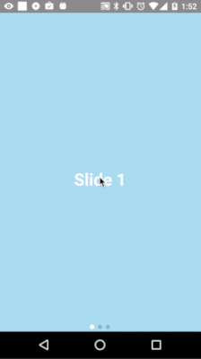

# Tsjing Carousel

This project is based on [http://github.com/leecade/react-native-swiper](leecade/react-native-swiper).
It does not support every feature of the original lib yet, but it resolves a lot of issues on both Android and iOS.
It uses the native ViewPagerAndroid for Android and ScrollView for iOS with pagingEnabled.



## How to use
* Install via npm
```
npm i --save dejakob/tsjing-carousel
```
* Import into your project
```
import Carousel from 'tsjing-carousel';
```

## Properties
| Property | Type | Description |
|:----:|---|---|
|onPageChange|Function|Fires when the page is changing with old page index, new page index|
|onPageChangeDone|Function|Fires when the page has changed with new page index|
|dotsHeader|Component|Component to put above the navigation dots|
|dotsFooter|Component|Component to put below the navigation dots|
|dotsStyle|Object|Override styling of the dots navigation|
|dotStyle|Object|Override styling of an inactive dot|
|activeDotStyle|Object|Override styling of an active dot|
|autoPlay|Boolean|Slide the carousel automatically (false by default)|
|autoPlayTimeout|Number|Timeout between moving slides for the animation|
|index|Number|Index of default page to show|

## To be implemented / Todo
* Vertical carousel
* Infinite paging (loop)
* Unit tests


